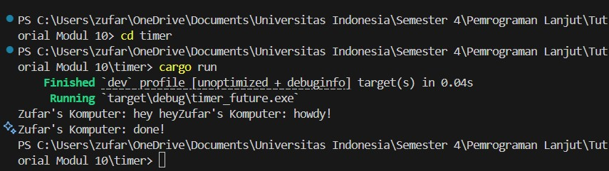
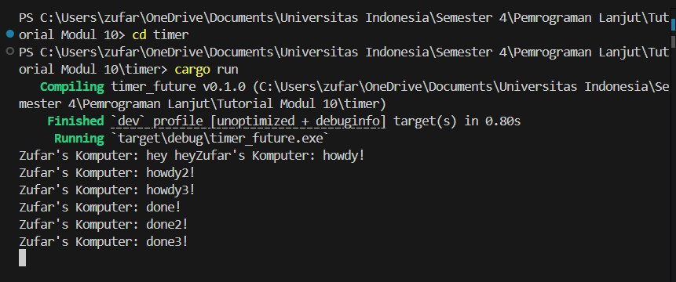

# Reflection Tutorial Modul 10

**Zufar Romli Amri**  
**NPM**: 2306202694  
**Kelas**: A

---

### 1.2 Understanding how it works.

Pada output program yang terlihat di gambar, hasil dari menjalankan cargo run menunjukkan urutan cetakan sebagai berikut:

Zufar's Komputer: hey hey

Zufar's Komputer: howdy!
(lalu jeda beberapa detik)

Zufar's Komputer: done!

Urutan ini sangat masuk akal jika kita melihat implementasi kode pada main.rs dan lib.rs. Berikut penjelasannya:

Program dimulai dari fungsi main, yang pertama-tama mencetak "Zufar's Komputer: hey hey" secara sinkron, langsung setelah spawn dipanggil tapi sebelum executor.run() dijalankan. Kemudian, program menjadwalkan satu task async menggunakan spawner.spawn, yang menjalankan blok async berisi dua perintah: mencetak "howdy!", lalu menunggu selama 2 detik (TimerFuture::new(Duration::new(2, 0)).await), dan akhirnya mencetak "done!".

TimerFuture sendiri adalah future yang akan selesai (Poll::Ready) setelah waktu yang ditentukan habis. Sementara itu, future ini akan mengembalikan Poll::Pending dan menyimpan waker agar thread timer bisa membangunkan task tersebut saat waktu habis. Dengan kata lain, thread terpisah tidur selama 2 detik, lalu membangunkan executor untuk melanjutkan polling future.

Executor kemudian mem-poll task pertama kali sehingga "howdy!" dicetak, lalu menemukan bahwa TimerFuture masih Pending, jadi task dikembalikan ke antrean. Setelah 2 detik, thread yang melakukan sleep membangunkan task tersebut via waker, dan executor mem-poll kembali task tersebut. Karena kini timer selesai (completed = true), maka Poll::Ready dikembalikan dan "done!" dicetak.

Secara ringkas, urutan output yang dihasilkan mencerminkan kombinasi antara eksekusi sinkron (yang langsung dieksekusi dalam main) dan eksekusi asinkron yang ditangani melalui sistem future dan executor. Urutan "hey hey" → "howdy!" → (tunggu) → "done!" mencerminkan bahwa executor berjalan dengan benar dalam memproses future hingga selesai.

---

### 1.3 Multiple Spawn and removing drop.

Perilaku program yang menghasilkan output berurutan seperti pada gambar, dapat dijelaskan berdasarkan dua perubahan penting dalam kode: (1) penggunaan multiple spawn, dan (2) penghapusan drop(spawner).

Ketika spawn dipanggil beberapa kali, masing-masing task asynchronous dimasukkan ke dalam antrean eksekusi (ready_queue). Executor akan mengeksekusi task-task ini satu per satu dalam urutan antrean. Setiap task akan mencetak pesan "howdy!", "howdy2!", dan "howdy3!" secara langsung karena itu adalah bagian dari eksekusi sebelum future TimerFuture melakukan await. Setelah mencetak pesan awal, setiap task masuk ke status Pending karena TimerFuture menunggu selama dua detik, dan executor berhenti memproses task itu sampai bangun kembali.

Hal yang menarik terjadi karena baris drop(spawner) dihapus. Dalam implementasi sebelumnya, drop(spawner) digunakan untuk memberi sinyal bahwa tidak akan ada task tambahan yang dikirim ke ready_queue, sehingga executor bisa berhenti saat antrean kosong. Dengan menghapus baris ini, Spawner tetap hidup, sehingga executor terus menunggu task baru meskipun antrean sudah kosong. Namun, karena tidak ada task tambahan yang benar-benar dikirim setelah awal, executor tetap akan berhenti secara alami setelah menyelesaikan semua task yang telah dikirim sebelumnya. Hal ini tidak menimbulkan error karena semua task sudah terkirim sebelum executor dijalankan.

Secara keseluruhan, hasil output yang muncul secara berurutan dari howdy!, howdy2!, howdy3!, hingga done3! merupakan hasil dari pemrosesan serial oleh executor terhadap masing-masing task, dan setiap task berjalan secara bergantian pada satu thread. Executor akan menyelesaikan satu polling task lalu lanjut ke task lain, dan akan kembali ke task yang Pending (seperti yang menunggu timer) saat waker membangunkan task tersebut.

---